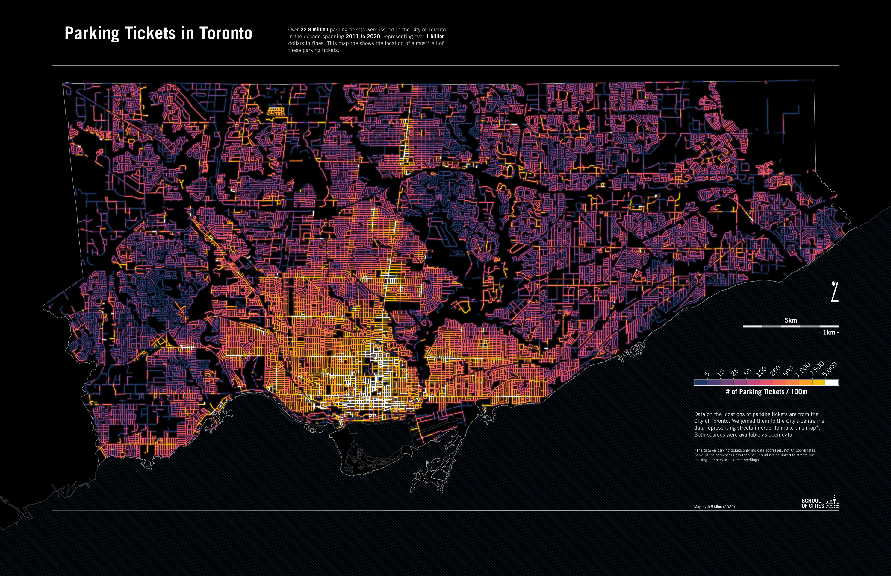

## parking-tickets-toronto

Visualizing Toronto's open data on the location, type, and $ of parking tickets.

https://schoolofcities.github.io/parking-tickets-toronto/

Parking ticket data can be downloaded from [here](https://open.toronto.ca/dataset/parking-tickets/)

To map, we also need the City's Centreline data, downloaded from [here](https://open.toronto.ca/dataset/toronto-centreline-tcl/)

These should be added to sub-folders under data before running any code/notebook

```
data/
-- centreline/
-- parking-tickets/
```
